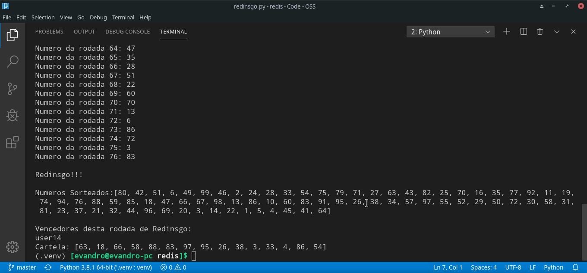

<h1>Redinsgo - Atividade Prática Redis</h1>

Jogo de bingo feito usando estruturas do Redis. Atividade prática da Disciplina de Banco de Dados Não Relacional sobre o conteúdo de Redis.

A explicação do problema se encontra no [link](https://www.dropbox.com/sh/45stbqgbj2nzuy5/AAB8T7F3gEjLzIzKc8Uqh6g2a/Atividades?dl=0&preview=1.+Exercicios+-+Redis+-+Alunos.pdf&subfolder_nav_tracking=1).

<h2>Setup:</h2>
Para rodar o Redinsgo é necessário:

* Python versão 3.8.1;

* Ter uma instancia do Redis funcionando;

* Instalar as dependências que estão no arquivo _requirements.txt_:
``` terminal
pip install -r requirements.txt
```
<h2>Configurações:</h2>
Este programa está configurado para rodar com uma instância do Redis localizado no localhost, na porta 6379.

Caso o Redis esteja rodando em outro local ou porta, deve-se alterar as configurações feitas no método \_\_init\_\_ da classe __Redinsgo__, localizada no arquivo _redinsgo.py_.

As instruções de configuração podem ser encontradas na documentação do [redis-py](https://redis-py.readthedocs.io/en/latest/). Outra página com descrições úteis se encontra neste [link](https://redislabs.com/lp/python-redis/).

<h2>Executando:</h2>
Para executar o Redinsgo basta executar o arquivo _redinsgo.py_:

``` terminal
phython redinsgo.py
```
Após chamar o comando deverá aparecer a seguinte saida no console:


Esta saida mostra os números sorteados por rodada. Quando um usuário ganha é apresentado a palavra 'Redinsgo!!!', seguida de todos os números sorteados. Após isto são apresentados todos os usuários ganhadores, seguidos de suas cartelas.

